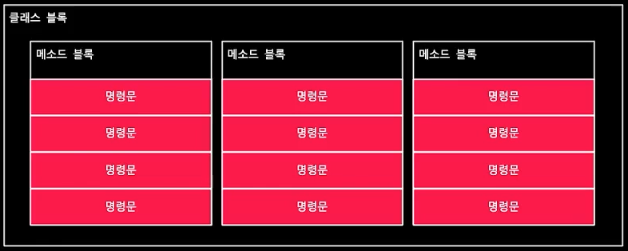
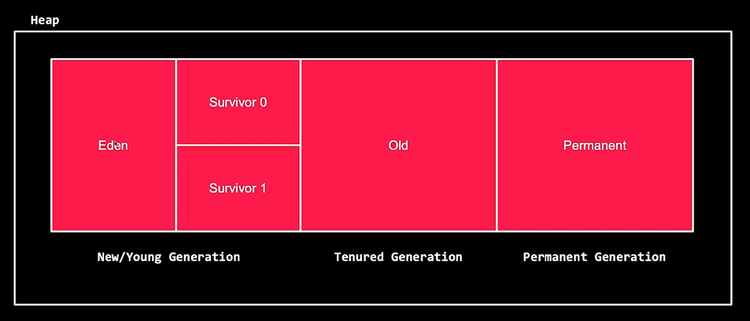

## java
+ 자바의 특징
    +   객체 지향적인 언어
        - object 클래스에서 모든 클래스가 파생
    +   플랫폼 독립적
        - JVM 위에서 동작하기 때문에 OS 에 종속적이지 않음
    +   메모리 관리
        -   Garbage collector 가 존재하기 때문에 개발자가 직접 메모리 할당/해제를 해주지 않아도 됨
  
+ 자파 파일과 컴파일러 동작
  1. 소스 코드 작성 Hellow.java 
  2. 컴파일러가 Hellow.java를 Hellow.class로 변환
      - JVM이 인식할 수 있는 Binary file
  3. JVM으로 프로그램 실행

## 자바 코드 구조
+  클래스 블록, 메소드 블록, 명령문으로 구성됨
     - 
  
+ 클래스 블록
  - 자바 코드의 가장 바깥쪽 영역을 의미
  - 클래스명은  자유롭게 정할 수 있음
  - 클래스명은 소스 파일의 이름과 동일해야 함
  - 하나의 클래스 블록은 여러 메소드 블록을 포함할 수 있음
  - 클래스 블록은 중괄호 { }로 감싸져야 함
  
+ 메소드 블록
  - public, private, protected 는 메소드의 접근 제어자
  - static 은 static 메소드를 만들기 위해 활용
  - void 는 해당 메소드 블록이 수행된 후 반환되는 데이터 구조를 의미
  - 반환되는 데이터 구조는 메소드 당 하나
  - 메소드 명 역시 자유롭게 정할 수 있음

## 자료형
+ 기본 자료형(primitive Type)
  - 데이터를 저장하기 위해 사용하는 자료형
  - 변수에 "실제 값"을 가짐
  - 예: int, double
  
+ 참조 자료형(Reference Type)
  - 데이터가 저장된 메모리의 주소값을 가지는 자료형
  - 예: String, ArrayList
  
+ 래퍼 클래스 (Wrapper Class)
  - 기본 자료형을 클래스로 감싸는 것으로 객체로 다루기 위한 클래스

## 참조 자료형(Reference Data Type)
  - String: 문자열
  - ArrayList: 동적 배열
  - HashMap: 키-값을 쌍으로 저장
  - HashSet: 중복 없는 값을 저장하기 위해 사용
  - LinkedList: 연결 리스트
  - Queue: 큐
  - Stack: 스택
  
## 변수에 값 대입
  - 대입 연산자(assignment operator) "=" 를 활용하여 변수에 값을 대입
  
## JVM
+ JVM = Java Virtual Machine = 자바를 실행하기 위한 가상 머신
  - JAva 어플리케이션은 JVM 위에서 동작하기 때문에 OS에 종속적이지 않음.
  - 스택 기반의 가상 머신으로 클래스 로더, 실행 엔진, Runtime Data Area로 구성되어 있음

+ 클래스 로더
  - .class 파일을 로드하고, jar 파일 내 저장된 클래스를 JVM 위에 탑재하는 역할
  
+ 실행 엔진
  - 인터프리터와 JIT(Just in time)으로 클래스를 실행
  - 가비지 컬렉터로 사용하지 않는 메모리를 찾아 삭제

+ Runtime Date Area
  - 프로그램 수행을 위해 os 에서 할당받은 메모리 공간 (Thread, Heap,...)

## JVM 내 Heap 영역
  - 객체를 저장하는 가상 메모리 공간으로 new 연산자로 생성되는 객체를 저장
  - 
  
  + New/Young Generation
    - 가비지 컬렉터에 의해 사라질 수 있음 (Minor GC)
  
  + Eden
    - 객체가 최초로 생성되는 공간
    - 해당 영역이 가득차면 가비지 컬렉터가 동작 (Survivor 1 영역으로 복사 후 객체 삭제)
  
  + Survivor 0, 1
    - Eden에서 참조되는 객체가 저장되는 공간   

  + Old Generation
    - 가비지 컬렉터에 의해 사라질 수 있음 (Major GC, Minor GC 에 비해 속도가 느림)
    - New/Young Generation 에서 살아남은 객체가 저장되는 공간

  + Permanent Generation
    - 생성된 객체의 주소 값, meta 정보가 저장되는 공간  

## 의미있는 코드 Style

+ 1.1.Constructor vs Static Factory Method

    Java 세상에서는 인스턴스를 생성하는 방법은 대략 2가지 정도 된다.  
    첫 번째는, 기본적으로 제공하는 생성자;Constructor Method를 이용하는 방법이다. 
    두 번째는, 정적 팩토리 메서드; Static Factory를 이용하는 방법이다. 

+ 1.2.정적 팩토리 메서드의 장점

    첫 번째, 이름(Naming)을 가질 수 있다. (의미 전달;) 
        생성자에 넘기는 매개변수와 생성자 자체만으로는 반환될 객체의 특성을 제대로 설명하지 못한다. 반면 정적 팩토리는 이름만 잘 지으면 반환될 객체의 특성을 쉽게 묘사할 수 있다. 
    두 번째, 호출될 때마다 인스턴스를 새로 생성하지 않아도 된다. (Singleton; 메모리 효율) 
        불변 클래스는 인스턴스를 미리 만들어 놓거나 새로 생성한 인스턴스를 캐싱하여 재활용하는 식으로 불필요한 객체 생성을 피할 수 있다. 

    세 번째, 반환 타입의 하위 타입 객체를 반환할 수 있는 능력이다. (다형성;) 

    네 번째, 입력 매개변수에 따라 매번 다른 클래스의  인스턴스를 반환 할 수 있다.(SOLID의 OCP;) 

    다섯 번째, 정적 팩토리 메서드를 작성하는 시점에는 반환할 클래스에 객체가 존재하지 않아도 된다. 

+ 1.3.정적 팩토리 메서드의 단점
    첫 번째, 상속할 수 없다. 
        기본 생성자의 접근 제한자가 Private으로 선언되기 때문에 상속할 수 없다. 

    두 번째, 정적 팩토리 메서드 찾기가 어렵다. 
        일반적인 생성자와 다른 메서드명을 사용하기 때문에 이러한 코드가 익숙하지 않은 동료 개발자는 인스턴스를 생성하는 역할을 하는 메서드 찾기가 쉽지 않을 것이다. 
        from; Date d = Date.from(instant); 
        매개변수를 하나 받아서 해당 타입의 인스턴스를 반환하는 형변환 메서드 
        of; Set<Developer> dev = EnumSet.of(YOO, JIN, HO); 
        여러 매개변수를 받아 적합한 타입의 인스턴스를 반환하는 집계 메서드 
        valueOf; Boolean isTrue = Boolean.valueOf("true"); 

## Builder 패턴

+ 1.1.생성자와 정적 팩토리의 한계
    선택적 매개변수가 많을 때 정적 팩토리와 생성자는 적절히 대응하기 어렵다. 

    ### Why?
    첫 번째는, 메서드를 호출하는 과정에서 파라미터를 할당할 때 매개변수의 순서를 틀리거나 누락할 수 있다는 휴먼 에러를 내포하고 있다. 

    두 번째는, 가독성이 매우 현저하게 떨어진다. 

+ 1.2.Builder 패턴으로 문제해결
	Builder 패턴을 이용하면 이러한 문제를 해결할 수 있으며 방법은 크게 2가지로 나뉜다. 

    ### How? 
    첫 번째는, Builder 패턴을 클래스 내부에서 직접 구현하는 방식 

    두 번째는, Lombok에서 제공하는 어노테이션으로 적용하는 방식 

    (추가) 공부할 때 시스템의 흐름과 원리를 이해하고 선언할 수 있어야 한다. 
